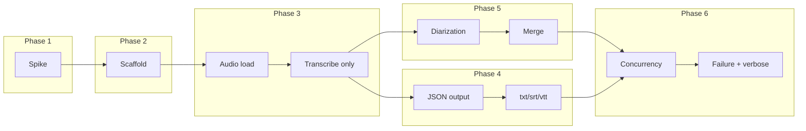

# transcribe Implementation Plan

Execution order follows dependency flow: spike unblocks scaffold; scaffold unblocks pipeline; transcription-only before diarization; JSON before other output formats; concurrency and failure handling after the happy path.

---

## Phase 1: Pre-implementation spike

**Goal:** Resolve unknowns so the spec and Package.swift are accurate; no production code yet.

- Run all seven spike items from [Implementation Readiness / Pre-Implementation Spike](specs/transcribe.md) (package layout, WhisperKit API, SpeakerKit API, merge/strategy, supported formats, model cache, word timestamps).
- Produce a short spike doc (e.g. `docs/spike-whisperkit-speakerkit.md` or a section in the spec) with: actual SPM product/target names, types and method names for audio load / transcribe / diarize / merge, list of supported input formats, cache behavior, and whether word timestamps are conditional.
- Update [specs/transcribe.md](specs/transcribe.md) and/or add `Package.swift` with correct dependency URLs, versions, and product names. Update "Supported Input Formats" and `--help` text if formats differ from the current list.

**Testing checkpoint:** None (spike is research). Deliverable: spike doc + updated spec/Package.swift checked in.

---

## Phase 2: Project scaffold and CLI contract

**Goal:** Buildable executable with full CLI surface and exit-code discipline; no real audio or model work yet.

- Add Swift package: [Package.swift](Package.swift) (or `Sources/transcribe/` layout per SPM convention) with dependencies from spike (WhisperKit, SpeakerKit, swift-argument-parser).
- Implement CLI with ArgumentParser: all options from the [CLI Contract](specs/transcribe.md) (audio file argument; `--model`, `--language`, `--output-dir`, `--format`, `--stdout`, `--min-speakers`, `--max-speakers`, `--no-diarize`, `--speaker-strategy`, `--model-dir`, `--overwrite`, `--verbose`, `--version`, `--help`). Enforce semantics: `--stdout` only with txt; `min <= max` when both speaker options set; invalid combinations exit with code `2`.
- Use a single, consistent exit-code scheme: `0` success, `1` runtime failure, `2` invalid usage, `3` input file, `4` model, `5` output write. Ensure all user-facing errors and logs go to stderr.

**Testing checkpoint:**

- CLI parsing: valid invocations succeed (e.g. exit 0 with a stub run or early "not implemented" exit 1).
- Invalid option combinations (e.g. `--stdout` without txt, `--min-speakers` with `--no-diarize`, `--min-speakers 3 --max-speakers 2`) exit with code `2`.
- `--help` and `--version` produce expected output to stdout; nothing else to stdout unless `--stdout` is used later.

---

## Phase 3: Audio loading and transcription-only path

**Goal:** Load audio once via WhisperKit’s path; run Whisper only (no diarization); produce an in-memory transcript structure.

- Implement audio preparation: load from file path, decode/normalize/resample using WhisperKit’s expected API (from spike). Fail with exit `3` if file missing, unreadable, or unsupported/undecodable; list supported formats in error when known.
- Initialize WhisperKit with `--model` and `--model-dir`; implement transcription-only path when `--no-diarize` is set. Output: internal transcript representation (segments with start/end/text, optional words) suitable for later JSON and other formats.
- Handle "no speech" and very short audio: produce valid empty segment list; no crash. If spike shows short audio must skip diarization, apply the same rule here for the no-diarize path.

**Testing checkpoint:**

- Input file failures: missing file, unreadable file, unsupported format → exit `3` and clear stderr message.
- No-diarize mode: run on a small fixture (or mocked segment result); process completes and yields segment data.
- Empty or no-speech audio: valid empty output (e.g. empty segments), no crash; optional warning to stderr.

---

## Phase 4: Output layer — JSON first, then txt/srt/vtt

**Goal:** Atomic file writes, overwrite protection, and all four formats matching the spec.

- **JSON:** Define internal model matching the [JSON contract](specs/transcribe.md) (metadata, warnings, segments with speaker nullable, start/end, text, optional words). Write JSON to `{outputDir}/{basename}.json`. Atomic write: write to temp file in output dir then rename. If output file exists and `--overwrite` is not set, fail with exit `5` before any expensive work (check before loading audio or models).
- **Output file naming:** Basename from input filename (strip extension); support `--output-dir` (default current directory).
- **txt / srt / vtt:** Implement renderers from the same internal model. Plain text: merge consecutive same-speaker segments into paragraphs; include speaker and time range when diarization present (later). SRT: speaker prefix per cue when present. VTT: voice tags for speaker. Respect `--format` (default `txt,json`) and `--format all` → all four. `--stdout`: when txt is requested, write transcript text to stdout and do not write `.txt` file; logs only to stderr.

**Testing checkpoint:**

- Output file naming: for input `meeting.mp3` and `-o ./out`, expect `./out/meeting.txt`, `./out/meeting.json`, etc.
- Overwrite protection: existing output file without `--overwrite` → exit `5` before starting heavy work.
- Atomic writes: no truncated files; write to temp then rename.
- JSON schema stability: test asserts structure (metadata, segments array, segment fields, optional words).
- Golden-file tests: small fixture with known transcript; compare generated txt, json, srt, vtt to golden files (or structured assertions). Include no-diarize case (no speaker labels in outputs).
- `--stdout`: transcript on stdout, no `.txt` file; stderr unchanged.

---

## Phase 5: Diarization and merge

**Goal:** When diarization is enabled, run SpeakerKit on the same prepared audio and merge speaker labels into the transcript.

- Initialize SpeakerKit (with cache/model-dir from spike). Run diarization with `--min-speakers` and `--max-speakers` when provided. Implement or use library "merge" (from spike): assign speaker labels to segments (subsegment vs segment strategy).
- Implement degraded behavior: audio too short for diarization → warn, skip diarization, transcription-only output. Diarization returns no speakers → continue with `speaker: null`, add warning. Fewer than `--min-speakers` → continue with detected count, warn. SpeakerKit init failure when diarization requested → exit `4`.
- Ensure JSON and other formats use merged result: `speaker` populated or null per segment; `metadata.diarization_enabled`, `metadata.speakers_detected`, `metadata.speaker_strategy` set; warnings array used per spec.

**Testing checkpoint:**

- Diarization path: run with a fixture that has two speakers; confirm speaker labels in JSON and in txt/srt/vtt.
- Diarization fallback: short audio → diarization skipped, transcript still written; no speakers → null speakers, warning in JSON; fewer than min-speakers → warning, continue.
- SpeakerKit unavailable after init → exit `4`.

---

## Phase 6: Concurrency, failure hardening, and verbose logging

**Goal:** Transcription and diarization run concurrently; model download retry and output-write failures behave per spec; verbose mode gives useful diagnostics.

- **Concurrency:** When diarization is enabled, run transcription and diarization concurrently (e.g. `async let` or task group) on the same prepared audio. Merge only after both complete.
- **Failure behavior:** Model download fails → retry once, then exit `4`. Output write failure (e.g. disk full): exit `5`, do not leave truncated output files (write to temp and rename; on failure, remove temp).
- **Verbose:** When `--verbose` is set, emit progress and timing to stderr only (e.g. load audio, cache path, transcription/diarization start and complete, merge, write outputs, total time). Include where possible: duration, language, speaker count, cache hit vs download, realtime factor.

**Testing checkpoint:**

- Concurrency: with diarization enabled, both transcription and diarization are started without waiting for one to finish first (test via timing or mock).
- Model download: retry-on-failure behavior (can be tested with a failing/mock URL or env if feasible).
- Output write failure: simulate full disk or permission error; assert exit `5` and no truncated file left in place.
- Verbose: `--verbose` produces stderr output; no log output to stdout.

---

## Phase 7: Integration and test plan completion

**Goal:** All spec test plan items covered; manual smoke test; README/build/install instructions.

- Add any missing tests from the [Test Plan](specs/transcribe.md): CLI parsing and invalid combinations, output naming and overwrite, JSON stability, no-diarize mode, diarization fallbacks, empty/no-speech, short-audio diarization skip, golden files for all four formats.
- Use short deterministic fixtures in repo; document how to run tests and how to do a manual benchmark with a larger file (not in git).
- Update [README.md](README.md) with build (`swift build -c release`), install (`cp .build/release/transcribe ~/.local/bin/`), and usage examples from the spec.

**Testing checkpoint:**

- Full test suite passes.
- Manual run: `transcribe <audio>` produces expected txt + json (and optionally srt/vtt with `--format all`) with or without `--no-diarize`.

---

## Suggested test and fixture layout

- **Fixtures:** `Tests/fixtures/` or `Sources/transcribeTests/Fixtures/`: short audio (e.g. a few seconds) for deterministic tests; optionally a no-speech and a "two speaker" clip. Keep large files out of git.
- **Golden files:** `Tests/fixtures/golden/` or next to fixtures: e.g. `expected.txt`, `expected.json`, etc., for one or two input clips (no-diarize and diarize variants).
- **Unit tests:** CLI parsing, output naming, overwrite, JSON structure, renderers (txt/srt/vtt) from in-memory model. Use mocks or very short fixtures for WhisperKit/SpeakerKit if needed to avoid model download in CI.

---

## Dependency and file summary

| Phase | Depends on | Key artifacts                                           |
| ----- | ---------- | ------------------------------------------------------- |
| 1     | —          | Spike doc, updated spec, Package.swift                  |
| 2     | 1          | CLI with all options, exit codes                        |
| 3     | 2          | Audio load, WhisperKit init, transcript-only path       |
| 4     | 3          | JSON/txt/srt/vtt writers, atomic write, overwrite check |
| 5     | 3, 4       | SpeakerKit init, diarize, merge, degraded behavior      |
| 6     | 4, 5       | Concurrent run, retry, write failure handling, verbose  |
| 7     | 6          | Full test coverage, README, manual smoke                |

This ordering keeps each phase small and testable, defers diarization until the transcription and output pipeline is solid, and leaves concurrency and failure handling for after the happy path works.
